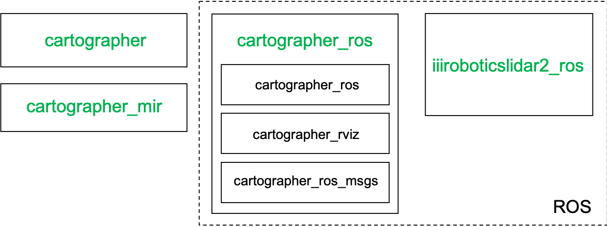
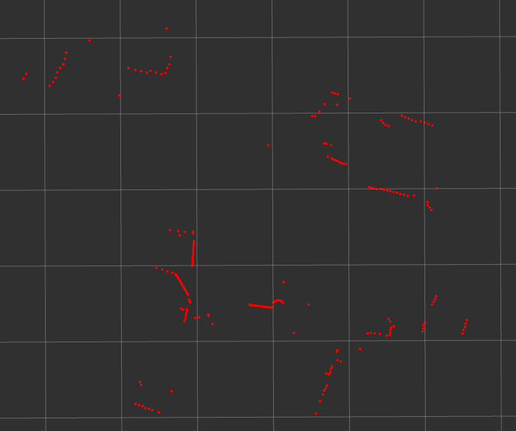

# Lidar Mapping User Guide v0.1

*If you just want to run the program, just read  "section 1. Introduction" , "section 2. Installation" and "section 3. Experiments Running" is fine. If you want more, continue to read second half of this guide.*

## 1. Introduction
This doc introduces how to obatain indoor base map via a one-way Lidar. We define the name of method as PiMap. For now, the algorithm we adopted is Cartographer. 

## 2. Installation
Cartographer can be used directly in the stand-alone version, or it can be used in ROS. In our demo, ROS vesion of cartographer is adopted.
Genearl diagram of sw installation is shown below:	
.

### System Requirements
* 64-bit, modern CPU (e.g. 3rd generation i7)
* 16 GB RAM
* 16.04 (Xenial)
* gcc version 4.8.4 and 5.4.0
### Step 2.1: Dependencies of Cartographer
Based on [Cartographer official doc](https://google-cartographer.readthedocs.io/en/latest/index.html)
```bash
sudo apt-get update

# Install CMake Ubuntu.
sudo apt-get install cmake -y

sudo apt-get install -y \
    clang \
    g++ \
    git \
    google-mock \
    libboost-all-dev \
    libcairo2-dev \
    libcurl4-openssl-dev \
    libeigen3-dev \
    libgflags-dev \
    libgoogle-glog-dev \
    liblua5.2-dev \
    libsuitesparse-dev \
    ninja-build \
    python-sphinx
```

### Step 2.2: ROS Kinetic
If ROS is previously installed on the computer, skip this step. If not, follow official method [install ROS kinetic on ubuntu 16.04](http://wiki.ros.org/Installation/Ubuntu) to install ROS Kinetic.
```
sudo sh -c 'echo "deb http://packages.ros.org/ros/ubuntu $(lsb_release -sc) main" > /etc/apt/sources.list.d/ros-latest.list'
sudo apt-key adv --keyserver hkp://ha.pool.sks-keyservers.net:80 --recv-key 421C365BD9FF1F717815A3895523BAEEB01FA116
sudo apt-get update
sudo apt-get install ros-kinetic-desktop-full
sudo rosdep init
rosdep update

echo source /opt/ros/kinetic/setup.bash  >> ~/.bashrc
source ~/.bashrc
```

### Step 2.3: Cartographer ROS integration
Based on [Cartographer ROS official doc](https://google-cartographer-ros.readthedocs.io/en/latest/
).
```bash
sudo apt-get install -y python-wstool python-rosdep ninja-build

mkdir catkin_ws
cd catkin_ws
wstool init src
wstool merge -t src https://raw.githubusercontent.com/googlecartographer/cartographer_ros/master/cartographer_ros.rosinstall
```
Replace .rosinstall file under catkin_ws/src with .rosinstall file from PerceptIn Map github (PerceptIn/Map/Lidar).
```bash
wstool update -t src
```
Then, all source code are downloaded from github, but we need to replace catkin_ws/src/cartographer_ros folder with the cartographer_ros folder in PerceptIn Map github (PerceptIn/Map/Lidar/cartographer_ros).

Install cartographer_ros’ dependencies (proto3 and deb packages). The command ‘sudo rosdep init’ will print an error if you have already executed it since installing ROS. This error can be ignored.
```bash
src/cartographer/scripts/install_proto3.sh
sudo rosdep init
rosdep update
rosdep install --from-paths src --ignore-src --rosdistro=${ROS_DISTRO} -y
```
Copy 3i Lidar SDK (iiiroboticslidar2_ros) from PerceptIn Map github (Map/Lidar/3iRobotics_Lidar/) into catkin_ws/src/.
(**WARNING**: By the way, your computer should have nanomsg installed before go to next step, if not, please refer to [this](https://github.com/nanomsg/nanomsg).)
(**WARNING**: Your computer is supposed to install gtest before hand, if not, please refer to [this](https://askubuntu.com/questions/145887/why-no-library-files-installed-for-google-test
https://github.com/google/googletest/issues/1933
https://www.eriksmistad.no/getting-started-with-google-test-on-ubuntu/
).
```
cd /usr/src/gtest
sudo mkdir build
cd build
sudo  cmake ..
sudo make
sudo mv libg* /usr/lib/
```
)

Then, build and install.
```bash
catkin_make_isolated --install --use-ninja
```
This step will totally installed 7 packages (
1. cartographer_ros_msgs, 
2. ceres-solver, 
3. cartographer, 
4. cartographer_ros, 
5. cartographer_mir, 
6. cartographer_rviz and 
7. iiiroboticslidar2).


Now, installation is all set.

## 3. Experiments Running
Experiments can be executed in two modes, online mode and offline mode.

### 3.1 Online Mode
#### Step 3.1.1: Connect LiDAR
Plug in two USB connectors of 3i LiDAR to the controller computer on the car. Change the previleige of USB port by typing.
```
sudo chmod 777 /dev/ttyUSB0
```
#### Step 3.1.2: Wireless Network setting
We use `ssh` for remote wireless control to log into controller computer on the car, make sure your PC and controller computer are under same network. When we need to run the experiments in the outside, we can use a seperate router to establish local network. 

#### Step 3.1.3: Launch 3iLiDAR ROS
Open a terminal(`TerminalA`) on your PC, ssh into controller computer, then navigate to 
```
$~/Documents/Tools/catkin_ws
```
Then
```
source install_isolated/setup.sh
source devel_isolated/setup.sh
```
**The above source commands applies to every newly-opened terminal to execute cartographer.**
Then
```
roslaunch iiiroboticslidar2 3iroboticslidar2.launch
```
when you see tons of screen print like "Receive Lidar count 384!" (Number 384 may be diffferent), it means LiDAR is working now.

#### Step 3.1.4: Launch Rosbag Recording
Open another terminal(`TerminalB`) and navigate to
```bash
$~/Documents/Tools/catkin_ws
```
Then
```bash
source install_isolated/setup.sh
source devel_isolated/setup.sh
```
Then
```
rosbag record -e "/scan"
```

#### Step 3.1.5: Launch Cartographer
Here, cuz we are using ssh remote control, so no Display device is connected to controller computer. So we just list cartographer command of online non-GUI mode. 
Same way like last subsection, open another terminal(`TerminalC`), navigate to
```bash
$~/Documents/Tools/catkin_ws
```
Then
```bash
source install_isolated/setup.sh
source devel_isolated/setup.sh
```
Then
```bash
roslaunch cartographer_ros pi_robot_1_3.launch
```
pi_robot_1_3.launch is the launch file of online non_GUI mode we created.
It is located at `catkin_ws/install_isolated/share/cartographer_ros/launch`
Then Cartographer begins to map and it is sending pose out to Sonar via nanomsg.

Other launch files located at here are:
pi_robot_1.launch: online GUI mode
pi_robot_1_2.launch: offline mode, for ROS bag.
so you can switch to other modes by using different launch files, more modes of cartographer will be discussed in later section.

#### Step 3.1.6: Save result files
Press "Ctrl + c" in `TerminalC`.
No need to save map manually any more, it is  combined with cartographer_node running via rewriting *node.cc*.
The path of output files are predifined in *pi_robot_1_3.launch* .

#### Step 3.1.7: Rename files
Rename output files by user-defined name string.
```
./rename_lidar_sonar_out_files.sh 0819_A4_F2_08_V2_LJ_offline
```
*rename_lidar_sonar_out_files.sh* can be donwloaded from "Map/Fusion/" folder of github repository.

### 3.2 Offline Mode
The input file path and output file path are defined by the user who want to run this experiment, please modify the path correspondingly when you are playing with following steps.

#### Step 3.2.1: Launch Offline Cartographer
Open a terminal on your PC, then navigate to 
```
$~/Documents/Tools/catkin_ws
```
Then
```
source install_isolated/setup.sh
source devel_isolated/setup.sh
```
The above source commands applies to every newly-opened terminal to execute cartographer.
Then
```
roslaunch cartographer_ros pi_robot_1_2.launch bag_filename:=/home/ubuntu/Documents/Tools/scripts/inputs/0730_glb_optm_rosbag_test/bagfiles/2019-08-05-18-00-50_0805_line_Lobby_03.bag 
```
rosbag can be downloaded from [link](https://drive.google.com/drive/folders/1hidey2XmoEzkyYZ41_HIcDlyi4odxClL?usp=sharing). 8 test cases are listed at Pi_LiDAR_Sonar_Dataset/LiDAR_Data/. 


#### Step 3.2.2: Save result files
When all information of rosbag is played, press "Ctrl + c" in this terminal.
No need to save map manually any more, it is  combined with cartographer_node running via rewriting *node.cc*.
The path of output files are predifined in *pi_robot_1_2.launch* which locates at
"catkin_ws/src/cartographer/ros_cartographer/ros_launch/".

#### Step 3.2.3: Rename files
Rename output files by user-defined name string.
```
./rename_lidar_sonar_out_files.sh 0819_A4_F2_08_V2_LJ_offline
```
*rename_lidar_sonar_out_files.sh* can be donwloaded from "Map/Fusion/" folder of github repository.

## 4. iii robot LiDAR
The Lidar we use here is 3iRobotics B0602 LiDAR, the user guide and spec are uploaded in the /Map/Lidar/3iRobotics_Lidar github. This LiDAR can be run on the top of Linux and Windows. In the Linux running, it can run with or withour ROS. We use ROS hope to be easy to integrate with Cartographer_ros, so iiiroboticslidar2_ros folder shipped with vendor is what we used for experiments above.
Some important parameters of LiDAR is listed below:

* Detection Range: 0.13 m ~ 6 m
* Sample Rate: 2K Hz
* Scan Rotation Rate: 6.2 Hz
* Precision:  0.25 mm

Two methods to use this Lidar.
Method 1:
```bash
roslaunch iiiroboticslidar2 view_3iroboticslidar2.launch 
```
It will show point cloud in a rviz GUI as below.

.

Method 2:
```bash
roslaunch iiiroboticslidar2 3iroboticslidar2.launch
rosrun iiiroboticslidar2 iiirobotics_lidar2_node_client
```
It will the show raw data of radar scan like this:
```
[ INFO] [1552653948.640657815]: : [345.000000, 2.158250]
[ INFO] [1552653948.640722304]: : [346.000000, 2.171000]
[ INFO] [1552653948.640780670]: : [347.000000, 2.182000]
[ INFO] [1552653948.640842308]: : [348.000000, 2.184750]
[ INFO] [1552653948.640911860]: : [349.000000, inf]
[ INFO] [1552653948.640983331]: : [349.999969, 1.245500]
[ INFO] [1552653948.641046686]: : [351.000000, inf]
[ INFO] [1552653948.641116805]: : [352.000000, inf]
```
It is made up by [INFO] [timestamp]: : [counter, distance] 

## 5. Cartographer in detail
### 5.1 configuration file
A congiguration file (.lua script) is used to define robot configurations, such as tracking_frame, use_odometry and so on.
All configuration files written by us are uploaded to Map/Lidar/cartographer_ros/cartographer_ros/configuration_files/pi_robot_1.lua
The configuration in pi_robot_1.lua is shown here:

```
include "map_builder.lua"
include "trajectory_builder.lua"

options = {
  map_builder = MAP_BUILDER,
  trajectory_builder = TRAJECTORY_BUILDER,
  map_frame = "map",
  tracking_frame = "laser",
  published_frame = "laser",
  odom_frame = "odom",
  provide_odom_frame = true,
  publish_frame_projected_to_2d = false,
  use_odometry = false,
  use_nav_sat = false,
  use_landmarks = false,
  num_laser_scans = 1,
  num_multi_echo_laser_scans = 0,
  num_subdivisions_per_laser_scan = 1,
  num_point_clouds = 0,
  lookup_transform_timeout_sec = 0.2,
  submap_publish_period_sec = 0.3,
  pose_publish_period_sec = 5e-3,
  trajectory_publish_period_sec = 30e-3,
  rangefinder_sampling_ratio = 1.,
  odometry_sampling_ratio = 1.,
  fixed_frame_pose_sampling_ratio = 1.,
  imu_sampling_ratio = 1.,
  landmarks_sampling_ratio = 1.,
}

MAP_BUILDER.use_trajectory_builder_2d = true

TRAJECTORY_BUILDER_2D.submaps.num_range_data = 35
TRAJECTORY_BUILDER_2D.min_range = 0.13
TRAJECTORY_BUILDER_2D.max_range = 6.
TRAJECTORY_BUILDER_2D.missing_data_ray_length = 1.
TRAJECTORY_BUILDER_2D.use_imu_data = false
TRAJECTORY_BUILDER_2D.use_online_correlative_scan_matching = true
TRAJECTORY_BUILDER_2D.real_time_correlative_scan_matcher.linear_search_window = 0.1
TRAJECTORY_BUILDER_2D.real_time_correlative_scan_matcher.translation_delta_cost_weight = 10.
TRAJECTORY_BUILDER_2D.real_time_correlative_scan_matcher.rotation_delta_cost_weight = 1e-1

POSE_GRAPH.optimization_problem.huber_scale = 1e2
POSE_GRAPH.optimize_every_n_nodes = 35
POSE_GRAPH.constraint_builder.min_score = 0.65

return options
```
### 5.2 launch file
Launch file is used to run different roslaunch commands. The recommended usage of Cartographer is indeed to provide a custom .launch file per robot and type of SLAM.
All launch files written by us are uploaded to Map/Lidar/cartographer_ros/cartographer_ros/launch/.
As we described before, 
**pi_robot_1.launch** is used to make robot to execute SLAM online (in real time) with real Lidar data, and it also spawns a rviz window configured to visualize Cartographer’s state.
The configuration of pi_robot_1.launch is shown here:
```
<launch>
  <param name="/use_sim_time" value="true" />

  <node name="cartographer_node" pkg="cartographer_ros"
      type="cartographer_node" args="
          -configuration_directory $(find cartographer_ros)/configuration_files
          -configuration_basename pi_robot_1.lua"
      output="screen">
    <remap from="scan" to="scan" />
  </node>

  <node name="cartographer_occupancy_grid_node" pkg="cartographer_ros"
      type="cartographer_occupancy_grid_node" args="-resolution 0.05" />

  <node name="rviz" pkg="rviz" type="rviz" required="true"
      args="-d $(find cartographer_ros)/configuration_files/demo_2d.rviz" />

</launch>
```
**pi_robot_1_3.launch** is also used to make robot to execute SLAM online (in real time) with real Lidar data,  but no rviz window is launched for this one, cuz it is used for our ssh remote control mode, no monitor is connected with controller computer on the top of car. The file goes like:
```
<launch>
  <param name="/use_sim_time" value="true" />

  <node name="cartographer_node" pkg="cartographer_ros"
      type="cartographer_node" args="
          -configuration_directory $(find cartographer_ros)/configuration_files
          -configuration_basename pi_robot_1.lua"
      output="screen">
    <remap from="scan" to="scan" />
  </node>

  <node name="cartographer_occupancy_grid_node" pkg="cartographer_ros"
      type="cartographer_occupancy_grid_node" args="-resolution 0.05" />

</launch>
```
**pi_robot_1_2.launch** uses a `bag_filename` argument to replay data from a recording and it also spawns a rviz window configured to visualize Cartographer’s state. It is shown here:
```
<launch>
  <param name="/use_sim_time" value="true" />

  <node name="cartographer_node" pkg="cartographer_ros"
      type="cartographer_node" args="
          -configuration_directory $(find cartographer_ros)/configuration_files
          -configuration_basename pi_robot_1.lua"
      output="screen">
    <remap from="scan" to="scan" />
  </node>

  <node name="cartographer_occupancy_grid_node" pkg="cartographer_ros"
      type="cartographer_occupancy_grid_node" args="-resolution 0.05" />

  <node name="rviz" pkg="rviz" type="rviz" required="true"
      args="-d $(find cartographer_ros)/configuration_files/demo_2d.rviz" />

  <node name="playbag" pkg="rosbag" type="play"
      args="--clock $(arg bag_filename)" />

</launch>
```
### 5.3 Commands to run Different modes
#### Online GUI Mode
At terminal A:
```bash
sudo chmod 777 /dev/ttyUSB0
roslaunch iiiroboticslidar2 3iroboticslidar2.launch
```
At terminal B:
```bash
roslaunch cartographer_ros pi_robot_1.launch
```
#### Online Non-GUI Mode
At terminal A:
```bash
sudo chmod 777 /dev/ttyUSB0
roslaunch iiiroboticslidar2 3iroboticslidar2.launch
```
At terminal B:
```bash
roslaunch cartographer_ros pi_robot_1_3.launch
```

#### Offline GUI Mode
##### record ROS bag
At terminal A:
```
roscore
```
At terminal B:
```
roslaunch iiiroboticslidar2 3iroboticslidar2.launch
```
At terminal C:
```
mkdir ~/bagfiles
cd ~/bagfiles
rosbag record -a
```
we can rename bag file based on requirement.
##### offline running use self-created ROS bag
Open a terminal
```bash
roslaunch cartographer_ros pi_robot_1_2.launch bag_filename:=${HOME}/Documents/HDMAP_Creation/dataset/01_cartographer/bagfiles/our_bag.bag
```
### 5.4 Save Map
To Do List.

### 5.5 nanomsg send pose
We grab the translation (x, y) and rotation (Yaw theta) information from node.cc source code of cartographer_ros. And use nanomsg to send it out, the publish and subscribe mode of nanomsg is used here.
 
### 5.6 parameter tuning
To Do List.

## 6. Map fusion and post processing
To Do List.


