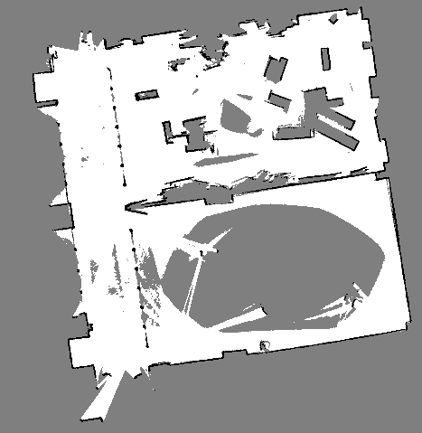
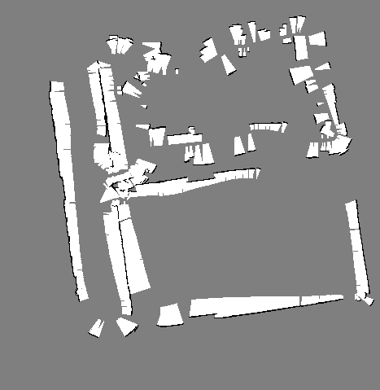
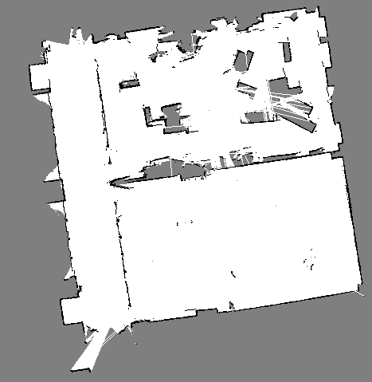

# PerceptIn Map Project

Indoor mapping with multiple sensors, including Lidar, Sonar, Camera and so on. A general diagram is shown below.

.

## Harware Setup

Hardware details:

Generation 1:
* 4-wheels chassis x 1
* HC-SR04 Sonar x 16
* 3iRobotics B0602 LiDAR x 1
* Controller Computer x 1

Generation 2:
* Pioneer 3Dx chassis x 1
* Polaroid Sonar x 16
* 3iRobotics B0602 LiDAR x 1
* Controller Computer x 1

## System Environment

OS and Software details:
The OS of controller computer put on top of chassis is:

* Ubuntu 16.04

The detailed software description is recorded in Lidar and Sonar ROS user guide. (*Lidar_Mapping_User_Guide_v0_1.md* and *Sonar_Mapping_ROS_User_Guide_v0_1.md*)

## Third Party Dependencies

Dependencies:
It is described in User guide of Lidar Mapping and Sonar Mapping respectively.

## Build

The build is conducted in seperate folder for Lidar and Sonar for now. All the build steps are explained in their user guide.

## System Running
Before running whole system, please read the user guide of Lidar Mapping and Sonar Mapping first. The following description is built upon the understanding of these two guides. Same here, whole system can be worked in two modes, online mode and offline mode.

### 1. Online Mode Running
Controll the robot, visit different places, at the same time record the raw data.
#### 1.1 Access to Controller computer
In order to achieve remote control for the chassis, we use a local computer, then get access to controller computer wirelessly via ssh. Once two computers are located in same local network, connection is easily to be set up.

#### 1.2 Launch Lidar Mapping
Plug two USB cables of Lidar into Controller computer, then executes commands listed in "*3. Expreiments*", "*3.1 Online Mode*" of Lidar user guide.
Then, Lidar begins to build map, and pose information is sending out via nanomsg at the same time.

#### 1.3 Launch Sonar Mapping
Turn on Pioneer 3Dx(12V DC power supply), plug USB cable of Chassis into Controller computer, Excecutes commands listed in "*3. Running*", "*3.1 Online Mode*" of Sonar ROS user guide.
Then, Sonar mapping is on the way.

#### 1.4 Control chassis to move around
Now, we can use keyboard of your local computer to control the chassis, cruise around the unknown areas you want to build the map.

#### 1.5 Results saving
When all the area is visited. 

Navigate to terminal of Sonar (refer to Sonar ROS user guide), stop the chassis, and quit sonar Mapping program . Then a file named **"sonar_2d_ogm.txt"** will be automatically saved, this is the source file of sonar maps.

Then navigate to terminal of Lidar (`TerminalC`, refer to lidar user guide) to quit. The file related to LiDAR mapping will be saved automatically. The file name can be specified by user, for example **"lidar_2d_ogm.pgm"**.

Exit from other terminal windows (iii Lidar `TerminalA`, rosbag `TerminalB`) via "Ctrl + c".

### 2. Offline Mode Running
Use the raw data collected in online mode for offline running.

#### 2.1 Run LiDAR Mapping
Refer to "*3. Experiments*", "*3.1 Offline Mode*" in Lidar user guide.

#### 2.2 Run Sonar Mapping
Launch Sonar Mapping after LiDAR mapping successfully finished and results are saved.
Refer to "*3. Running*", "*3.1 Offline Mode*" in Sonar ROS user guide.

## Test Case
Here, we recorded all the test cases we collected and tested for the Pi Map paper.

<pre>
1.
* `Scenes NAME`:	L6F11_1room
* `TAG_NAME`:		0807_SZU_L6F11_1m3_02
* `VERSION`:		0913_SZU_L6F11_02_NY_FILTER_offline
* `Rosbag NAME`:	0807_SZU_L6F11_1m3_02_2019-08-07-15-46-00_1st_room_filter.bag
* `FiTu Para path`:	Map/Lidar/Fine_Tune_Parameters/01_best_for_SZUF11_02/V2/

2.
* `Scenes NAME`:	L6F11_3room
* `TAG_NAME`:		0807_SZU_L6F11_1m3_06
* `VERSION`: 		0824_SZU_L6F11_06_V3_LJ_offline
* `Rosbag NAME`: 	0807_SZU_L6F11_1m3_06_2019-08-07-18-50-04.bag
* `FiTu Para path`:	Map/Lidar/Fine_Tune_Parameters/04_best_for_SZUF11_06/V3/

3.
* `Scenes NAME`:	L6F2_room
* `TAG_NAME`: 		0807_SZU_L6F02_1m3_08
* `VERSION`: 		0827_SZU_L6F02_08_V4_LJ_offline
* `Rosbag NAME`: 	0807_SZU_L6F02_1m3_08_2019-08-07-22-34-55.bag
* `FiTu Para path`:	Map/Lidar/Fine_Tune_Parameters/07_best_for_SZUF02_08/V4/

4.
* `Scenes NAME`:	KX_hallway
* `TAG_NAME`: 		0809_A4_F2_08
* `VERSION`: 		0819_A4_F2_08_V2_LJ_offline
* `Rosbag NAME`: 	0809_A4_F2_08_2019-08-09-15-56-08.bag
* `FiTu Para path`:	Map/Lidar/Fine_Tune_Parameters/14_best_for_A4F2_08/V2/

5.
* `Scenes NAME`:	KX_office
* `TAG_NAME`: 		0806_pi_office_1m3_07_tf_inter
* `VERSION`: 		0914_pi_office_07_NY_offline
* `Rosbag NAME`: 	08_06_pi_office_1m3_07_tf_inter_2019-08-07-04-17-32.bag
* `FiTu Para path`:	Map/Lidar/Fine_Tune_Parameters/19_best_for_pi_office_1009/V_default/

6.
* `Scenes NAME`:	L6F11_2room
* `TAG_NAME`:		0806_SZU_L6F11_1m3
* `VERSION`: 		0901_SZU_L6F11_00_V1_NY_offline
* `Rosbag NAME`: 	0807_SZU_L6F11_1m3_2019-08-07-14-55-24.bag
* `FiTu Para path`:	Map/Lidar/Fine_Tune_Parameters/02_best_for_SZUF11_00/V1/

7.
* `Scenes NAME`:	KX_lounge
* `TAG_NAME`: 		0805_line_Lobby_02
* `VERSION`: 		0902_line_Lobby_02_NY_offline
* `Rosbag NAME`: 	2019-08-05-16-56-36_0805_line_Lobby_02.bag
* `FiTu Para path`:	Map/Lidar/Fine_Tune_Parameters/18_best_for_KX_lounge_1009/V_default/

8.
* `Scenes NAME`:	KX_lobby
* `TAG_NAME`: 		0805_line_Lobby_03
* `VERSION`: 		0903_line_Lobby_03_NY_offline
* `Rosbag NAME`: 	2019-08-05-18-00-50_0805_line_Lobby_03.bag
* `FiTu Para path`:	Map/Lidar/Fine_Tune_Parameters/17_best_for_KX_lobby_0805_03/V2/
</pre>

**!!!IMPORTANT!!!**  

If you want to run the offline mode of the system by using raw data provided here, please confirm these things first.

(1). Use FineTune Parameters. Please replace "**catkin_ws/src/cartographer_ros/cartographer_ros/configuration_files/pi_robot_1.lua**" and "**catkin_ws/src/cartographer/configuration_files/trajectory_builder_2d.lua**" in source code with parameter files listed in FineTune Param Path, then recompile src code.

(2). Use Sonar raw data correspondingly. The file name of sonar raw scan data is **${TAG_NAME}_scan_raw_data_sonar.txt**, which will be passed to **-scan_raw_path** for sonar mapping. 

the file name of sonar pose data is **${TAG_NAME}_pose_raw_data.txt**, which will be passed to **-pose_raw_path** for sonar mapping.

(3). Please modify the input output files name correspondingly.

## Map Display
Feed two raw map files to map fusion script (Now it is Matlab script, it will be rewrited to Python once debug is over.). Then maps are created as below (Use indoor Pi office as an example):

Lidar Map:

Sonar Map:

Fusion Map:

## TO-DO list
(1). Fusion script version 2.0 for sonar lidar fusion.
(2). Collect all configurable parameters into a file, for example YAML file
(3). Introduce metrics.
(4). Next big step is adding Visions and Images, which is Semantics.

 

